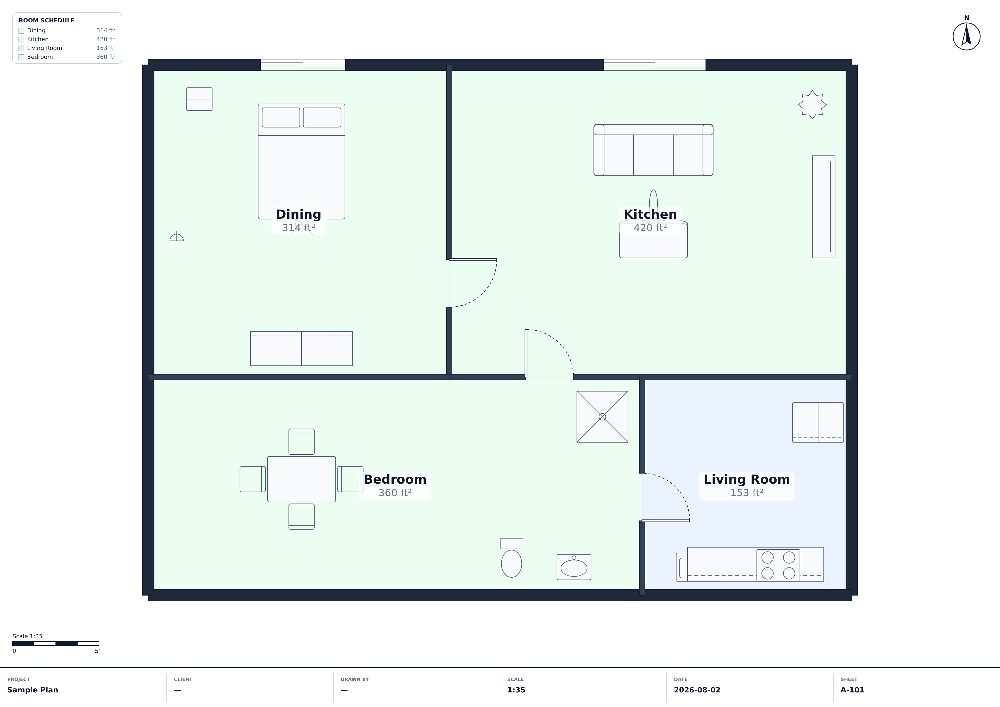

# Floor Plan Creator

A professional architectural floor planner that runs in the browser — the
approachability of Canva with the precision of AutoCAD.

Built with React, TypeScript and the Canvas 2D API. No drawing library, no
backend, no build-time codegen.



## Running it in your browser

Needs [Node.js](https://nodejs.org) 18 or newer (`node -v` to check).

```bash
git clone https://github.com/kumarkd69/Floorplanner.git
cd Floorplanner
git checkout claude/floor-plan-creator-s028fo
npm install
npm run dev
```

Then open **http://localhost:5173** — a sample 40 × 30 ft plan is already on the
canvas. Edits save to your browser automatically and reload with the page.

Other commands:

```bash
npm run build      # production bundle in dist/
npm run preview    # serve that bundle at http://localhost:4173
npm test           # 36 unit tests over the geometry, unit and export kernels
```

**`dist/index.html` will not work if you just double-click it.** Browsers block
JavaScript modules loaded over `file://`, so you get a blank page. The build has
to be served over HTTP — `npm run preview` is the quickest way, or any static
server (`npx serve dist`, `python3 -m http.server`) will do.

Asset paths in the build are relative, so `dist/` can be dropped anywhere —
a domain root, a GitHub Pages project site, or an S3 prefix — without
reconfiguration.

## Publishing to GitHub Pages

`.github/workflows/deploy-pages.yml` builds and publishes the app on every push
to the default branch. It needs Pages switched on once, by hand:

1. **Settings → Pages → Build and deployment → Source: _GitHub Actions_**
2. **Actions → Deploy to GitHub Pages → Run workflow** (or push any commit)

The site then appears at **https://kumarkd69.github.io/Floorplanner/**.

That first step cannot be automated: creating a Pages site requires admin
permissions the workflow token is not granted, so `actions/configure-pages`
with `enablement: true` fails with *Resource not accessible by integration*.
Until Pages is enabled, the workflow's "Configure Pages" step is expected to
fail; every step before it (tests, type-check, build) still runs and passes.

## What it does

**Everything is in feet.** One unit, everywhere — lengths in feet, areas in
square feet. Inputs still accept `12'6"` or `18in` if that is how you think
about a door, and convert on entry.

**Draw rooms like rectangles in Figma.** Pick the Room tool and drag. The room
appears with its four walls, its name, its dimensions and its area already on
the drawing. Hold ⇧ for a square. Then set it exactly: type a width, a height,
or a total square footage in the Layout panel and the walls move to match.

**Start from a room, not a blank sheet.** 35 ready-made rooms — foyer, washroom,
en-suite, puja room, utility, garage, balcony and the rest — each at a sensible
size. Click one, click the plan, done.

**Rooms share walls.** Place two rooms side by side and they land flush against
each other with exactly one wall between them — not two stacked walls, not a
sliver of a gap. Coincident walls are then fused into a single wall, and runs
that continue past a junction become one continuous wall. Move a room away
again and the shared wall separates cleanly.

**A plot to build inside.** Draw the plot once and every room, wall and object
snaps to it and is kept inside it. Resize the plot numerically like anything
else.

**Dimensions on the drawing itself.** Rooms carry their width, height and area;
the plot carries its size; walls that no room already dimensions carry their
length. Nothing has to be selected to be measured.

**Drawing.** Straight, angled and curved walls that chain as you click and weld
themselves at corners, so there are never gaps. Split, merge, extend, trim and
offset walls. Doors and windows snap to walls and cannot be dragged off the end
or through each other. A categorised furniture library of ~60 vector symbols
drawn at true dimensions, placed by click or drag-and-drop.

**Rooms are automatic.** Whenever walls form a closed loop, a room appears with
its name, area and perimeter. Draw a partition and one room becomes two; delete
it and they merge back. Names, finishes and notes you set survive every
subsequent edit. Manual rooms are supported for spaces that are not fully
enclosed.

**Precision.** Snapping to grid, endpoints, midpoints, corners, wall and room
edges, centres, furniture and angles, with magnetic alignment guides and live
measurements while you drag. Every length field accepts `12'6"`, `3.5m` or
`450mm` regardless of the project's display unit.

**Editing.** Figma-style selection — click, shift-click, marquee (right-to-left
crosses, left-to-right encloses), grouping, locking, z-order. Undo/redo with a
navigable history timeline, copy/paste, duplicate, mirror, rotate, scale, align
and distribute.

**Documentation.** Linear, horizontal, vertical, chain, baseline, angular and
radial dimensions; automatic wall lengths and room area labels; a layer manager
with visibility, locking, opacity and reordering; and door, window, room and
wall schedules.

**Export.** JSON (round-trips the full editable project), PNG at up to 4×, SVG
in true-scale millimetres, DXF R12 with AIA-style layers, and print/PDF — each
with a title block, north arrow, scale bar and room legend.

**Accessibility.** Full keyboard control, screen-reader labels, focus states, a
high-contrast mode and a large-cursor mode. Press `?` — or the toolbar's help
button — for the shortcut reference.

## How it is put together

```
src/
  types/       the domain model — Wall, Room, Door, Window, Furniture, …
  core/        geometry kernel, units, snapping, room detection, wall ops
  state/       observable store, history, project factory, edit operations
  render/      the canvas renderer and its themes
  hooks/       canvas interaction, viewport, keyboard, store subscription
  components/  toolbar, sidebar, inspector, canvas, dialogs
  export/      JSON, PNG, SVG, DXF, PDF and the sheet furniture
  data/        the furniture catalog
```

A few decisions worth knowing about:

**Everything is millimetres internally.** Feet exist only at the presentation
boundary (`core/units.ts`), so no arithmetic ever accumulates rounding error
from a display unit.

**Tools are strictly exclusive.** Switching tools abandons whatever the previous
one had in flight and disarms anything it had staged, so a half-drawn wall can
never keep rubber-banding under a new tool.

**Rooms own their walls.** A room drawn as a rectangle records the four walls it
created, so typing a new width moves exactly those walls — and dragging the room
carries its enclosure with it. When a wall ends up shared with a neighbour,
editing one room clones it rather than dragging the neighbour along.

**Neighbours outrank the grid.** A grid step is a foot and a wall is four
inches, so a grid-snapped edge can never sit exactly one wall from its
neighbour. Room placement therefore snaps to neighbours first and falls back to
the grid only on the axes that found nothing to latch onto. Alignments are
offered per edge: two left edges may always line up, but this room's right edge
only snaps to another's left when the two genuinely sit alongside each other.

**Walls weld rather than track joints.** Instead of modelling joint objects,
endpoints within 20 mm of each other are snapped onto a shared point after every
edit. Rendering, room detection and export then all see closed corners with no
special cases.

**Rooms come from planar face traversal.** Wall centrelines are split at their
intersections into a planar graph; walking half-edges by always taking the
tightest left turn traces every bounded face exactly once. New enclosures are
matched to existing rooms by containment — and, when rooms merge, by which
contributed the most area — so user-entered data follows the space it belongs to.

**The canvas repaints on a dirty flag, not on React state.** Pointer gestures
mutate the store many times per frame; the render loop coalesces them into one
paint per animation frame. Panels subscribe through `useSyncExternalStore` with
cached snapshots.

**Openings are punched, not painted over.** Walls render into an offscreen layer
where door and window openings are removed with `destination-out`, then the layer
is composited. The room floor shows through the opening, as it does on a real
plan.

### Performance

Measured in Chromium on a 200 × 200 ft site containing 5,764 objects — 5,400
furniture symbols, 232 auto-detected rooms, 96 doors and 36 walls:

| View | Median frame | 
|---|---|
| Whole site visible, every object on screen | **8 ms** (~125 fps) |
| Zoomed in, viewport culling active | **8 ms** (~120 fps) |

Getting there needed three things, each of which was worth roughly an order of
magnitude: paint order and the wall→openings index are memoised per project
revision rather than recomputed per frame; entities outside the viewport are
culled; and symbols smaller than 16 screen pixels degrade to a `fillRect` of
their footprint. That last one is counter-intuitive — collecting them into a
single batched path is *slower*, because one fill with thousands of subpaths
forces the rasteriser to sort every edge against every scanline.

### Extending it

The model and the store are deliberately open to the roadmap items — 3D views,
stair and roof generators, electrical/plumbing/HVAC planners, cost estimation,
AI layout assistance, collaboration. Entities are a discriminated union with
per-type geometry helpers, layers already exist for the services disciplines,
and every mutation flows through `store.commit`, which is where welding, room
reflow and history are applied. Adding an entity type means extending the union,
adding a `case` to the geometry/hit-test/render switches, and nothing else.

`window.__fpStore` exposes the live store for scripting and end-to-end tests.
